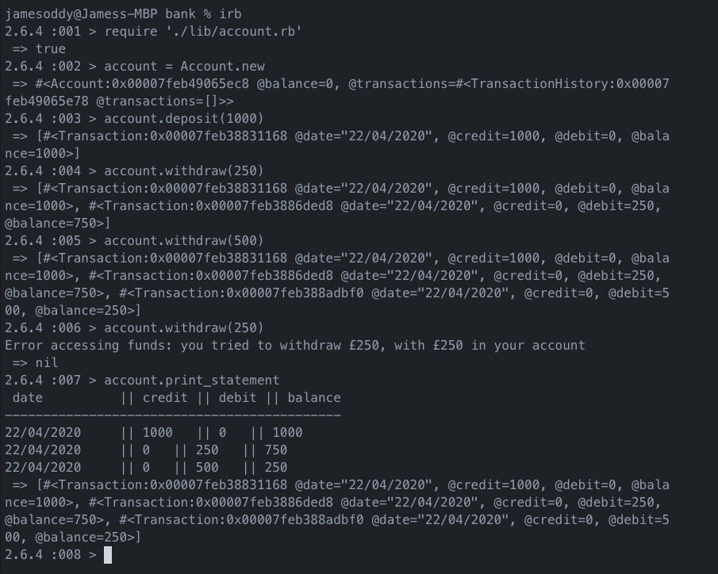

# Bank Tech Test #
```
As a user
So that I can keep a record of my money
I would like to create an account
```
```
As a user
I would like to deposit money into my account
```
```
As a user
I would like to withdraw money from my account
```
```
As a user
So I can see how much money is in my account
I would like to get a statement with date, amount and balance printed
```
```
As a user
I would like to see my balance after transactions
```
# Approach #
My original plan was to allow for the user to interact with the code via a command line interface, however after much deliberation in the planning process and futile attempts to hardcode if statements into the code I decided to stick to interacting via IRB.

# Coding process #
Throughout the process I tried to keep to the DRY and Single Responsibility Principle (although with some parts of the code DRY is still used).

I structured the code for ease of readability using mixins and kept the composition clean by maintaining low coupling to allow the code to be easily changed in the future if need be.

# Screenshot of finished project #


# How to run the program #

## First step: ##
```cl
% git clone https://github.com/jamesoddy8/bank_tech_test
% cd bank-tech-test
% bundle
```
## How to test the program ##

While in the root directory:

```
% rspec
```

## How to run the program in IRB ##
```
% irb
> require './lib/account.rb'
> account = Account.new
> account.deposit(1000)
> account.withdraw(750)
> account.withdraw(50)
> account.withdraw(200)
> account.print_statement
```
